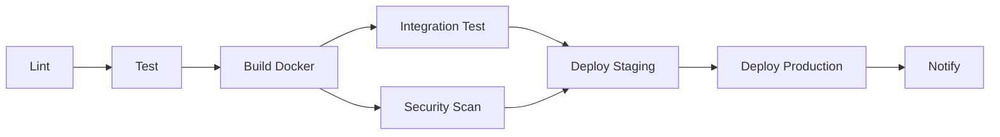

# CI/CD Implementation Guide

## 🚀 Overview

This project implements a complete CI/CD pipeline using **GitHub Actions** with Docker containerization. The pipeline automates testing, building, security scanning, and deployment.

---

## 📋 Pipeline Workflows

### 1. **Main CI/CD Pipeline** (`.github/workflows/ci-cd.yml`)

**Triggers:**
- Push to `main`, `develop/*`, `feature/*` branches
- Pull requests to `main` or `develop/*`
- Manual dispatch

**Jobs:**



#### Job 1: **Code Quality & Linting**
- Runs Black (code formatting)
- Runs Flake8 (PEP8 compliance)
- Runs MyPy (type checking)

#### Job 2: **Unit Tests & Coverage**
- Runs pytest with coverage
- Uploads coverage to Codecov
- Checks 70% coverage threshold
- Archives HTML coverage report

#### Job 3: **Build Docker Image**
- Builds multi-stage Docker image
- Pushes to GitHub Container Registry (ghcr.io)
- Caches layers for faster builds
- Tags: branch name, PR number, SHA

#### Job 4: **Integration Tests**
- Starts docker-compose stack
- Waits for Airflow initialization
- Validates DAG imports
- Tests service health endpoints
- Tears down stack

#### Job 5: **Security Scanning**
- Runs Trivy (vulnerability scanner)
- Runs Bandit (Python security linter)
- Uploads results to GitHub Security tab

#### Job 6: **Deploy to Staging**
- Triggers on `develop` branch
- Requires environment approval (optional)
- Deploys to staging environment

#### Job 7: **Deploy to Production**
- Triggers on `main` branch only
- Requires manual approval
- Creates GitHub release
- Tags with version number

#### Job 8: **Notifications**
- Can be configured for email or other integrations
- Includes build status and links

---

### 2. **Docker Image Publishing** (`.github/workflows/docker-publish.yml`)

**Triggers:**
- New releases
- Manual dispatch with custom tag

**Features:**
- Multi-platform builds (amd64, arm64)
- Publishes to GitHub Container Registry
- Optionally publishes to Docker Hub
- Updates Docker Hub description
- Semantic versioning tags

---

### 3. **Scheduled Pipeline Test** (`.github/workflows/scheduled-test.yml`)

**Triggers:**
- Daily at 2 AM UTC (cron schedule)
- Manual dispatch

**Purpose:**
- Tests full end-to-end pipeline execution
- Simulates production schedule
- Verifies data outputs
- Exports logs for analysis

---

## 🔧 Setup Instructions

### Step 1: Enable GitHub Actions

1. Go to your repository on GitHub
2. Navigate to **Settings → Actions → General**
3. Enable "Allow all actions and reusable workflows"

### Step 2: Configure Secrets

Go to **Settings → Secrets and variables → Actions** and add:

#### Required Secrets:
```yaml
# GitHub Container Registry (automatic, no setup needed)
GITHUB_TOKEN: <automatically provided>

# Optional: Docker Hub
DOCKERHUB_USERNAME: your-dockerhub-username
DOCKERHUB_TOKEN: your-dockerhub-access-token

# Optional: Additional integrations can be configured

# Optional: Codecov
CODECOV_TOKEN: your-codecov-token
```

#### How to Get Secrets:

**Docker Hub Token:**
```bash
# 1. Log in to hub.docker.com
# 2. Go to Account Settings → Security
# 3. Click "New Access Token"
# 4. Copy the token
```

**Codecov Token:**
```bash
# 1. Go to codecov.io
# 2. Sign in with GitHub
# 3. Add repository
# 4. Copy upload token
```

### Step 3: Configure Environments

1. Go to **Settings → Environments**
2. Create two environments:
   - `staging`
   - `production`

3. For `production`, add:
   - **Required reviewers**: Add team members who must approve
   - **Wait timer**: Optional delay before deployment
   - **Deployment branches**: Limit to `main` branch only

### Step 4: Enable GitHub Container Registry

1. Go to **Settings → Packages**
2. Enable "Improved Container Support"
3. Make packages public or private as needed

---

## 🎯 Usage

### Automatic Triggers

**On every push to `develop/*`:**
```
1. Lint → Test → Build → Integration Test → Security Scan
2. ✅ Auto-deploy to Staging (if all pass)
```

**On every push to `main`:**
```
1. Lint → Test → Build → Integration Test → Security Scan
2. ⏸️  Wait for manual approval
3. ✅ Deploy to Production (after approval)
4. 📦 Create GitHub Release
```

**On pull requests:**
```
1. Lint → Test → Build → Integration Test
2. ✅ Report status to PR
3. ❌ No deployment
```

### Manual Triggers

**Trigger CI/CD manually:**
```bash
# Go to Actions tab → CI/CD Pipeline → Run workflow
# Select branch and click "Run workflow"
```

**Build and publish Docker image:**
```bash
# Go to Actions tab → Docker Image Publish → Run workflow
# Enter custom tag (e.g., "v1.2.3") and run
```

**Run scheduled test:**
```bash
# Go to Actions tab → Scheduled Pipeline Test → Run workflow
```

---

## 📊 Monitoring CI/CD

### GitHub Actions Dashboard

View all workflow runs:
```
https://github.com/<owner>/<repo>/actions
```

### Status Badges

Add to README.md:
```markdown


[](https://codecov.io/gh/<owner>/<repo>)
```

### View Logs

**Job logs:**
1. Go to Actions tab
2. Click on workflow run
3. Click on specific job
4. View detailed logs

**Artifact downloads:**
1. Go to completed workflow run
2. Scroll to "Artifacts" section
3. Download coverage reports, logs, etc.

---

## 🐳 Docker Image Tags

Images are automatically tagged with:

| Tag Pattern | Example | When Created |
|-------------|---------|--------------|
| `branch-name` | `develop-0.0.4` | Every push to branch |
| `pr-<number>` | `pr-123` | Pull requests |
| `sha-<commit>` | `sha-abc1234` | Every commit |
| `<version>` | `v1.2.3` | GitHub releases |
| `latest` | `latest` | Push to `main` |

**Pull images:**
```bash
# Latest from main
docker pull ghcr.io/<owner>/<repo>:latest

# Specific version
docker pull ghcr.io/<owner>/<repo>:v1.2.3

# Specific branch
docker pull ghcr.io/<owner>/<repo>:develop-0.0.4
```

---

## 🔐 Security Scanning

### Trivy (Vulnerability Scanner)

Scans for:
- OS package vulnerabilities
- Python package vulnerabilities
- Dockerfile best practices
- Secrets in code

**View results:**
1. Go to **Security → Code scanning alerts**
2. Filter by "Trivy"

### Bandit (Python Security)

Checks for:
- SQL injection vulnerabilities
- Shell injection
- Hardcoded passwords
- Insecure functions

**View results:**
- Download artifact "security-reports"
- Open `bandit-report.json`

---

## 🚢 Deployment Strategies

### Current: Manual Approval for Production

**Staging:**
- Auto-deploys on `develop` branch push
- No approval required
- Good for testing

**Production:**
- Requires manual approval
- Deploys only from `main` branch
- Creates release tag

### Alternative: Canary Deployment

Add to production job:
```yaml
- name: Deploy canary (10%)
  run: |
    # Deploy to 10% of production traffic
    kubectl set image deployment/brewery-pipeline \
      app=ghcr.io/${{ github.repository }}:${{ github.sha }} \
      -n production
    kubectl scale deployment/brewery-pipeline-canary --replicas=1

- name: Wait and monitor
  run: sleep 300  # 5 minutes

- name: Full rollout (100%)
  run: |
    kubectl scale deployment/brewery-pipeline --replicas=10
    kubectl scale deployment/brewery-pipeline-canary --replicas=0
```

### Alternative: Blue-Green Deployment

```yaml
- name: Deploy to green environment
  run: |
    # Deploy new version to "green"
    kubectl apply -f k8s/green/
    
- name: Run smoke tests
  run: |
    curl -f http://green.brewery-pipeline.internal/health

- name: Switch traffic to green
  run: |
    kubectl patch service brewery-pipeline \
      -p '{"spec":{"selector":{"version":"green"}}}'
```

---

## 📈 Performance Optimizations

### 1. Cache Dependencies

Already implemented:
```yaml
- uses: actions/cache@v3
  with:
    path: ~/.cache/pip
    key: ${{ runner.os }}-pip-${{ hashFiles('requirements.txt') }}
```

### 2. Cache Docker Layers

Already implemented:
```yaml
- uses: docker/build-push-action@v5
  with:
    cache-from: type=gha
    cache-to: type=gha,mode=max
```

### 3. Matrix Builds (Test Multiple Python Versions)

Add to test job:
```yaml
strategy:
  matrix:
    python-version: ['3.9', '3.10', '3.11']
steps:
  - uses: actions/setup-python@v4
    with:
      python-version: ${{ matrix.python-version }}
```

### 4. Parallel Jobs

Jobs run in parallel by default unless `needs:` is specified.

---

## 🐛 Troubleshooting

### Issue: "Permission denied" on Docker push

**Solution:**
```bash
# Ensure GITHUB_TOKEN has package write permissions
# Go to Settings → Actions → General → Workflow permissions
# Select "Read and write permissions"
```

### Issue: Integration tests timeout

**Solution:**
```yaml
# Increase timeout in workflow
jobs:
  integration-test:
    timeout-minutes: 30  # Increase from default 15
```

### Issue: Docker build runs out of memory

**Solution:**
```yaml
# Use smaller base image or multi-stage build
# Already implemented in Dockerfile
```

### Issue: Tests pass locally but fail in CI

**Solution:**
```bash
# Check environment differences
# Run in Docker locally to replicate CI environment
docker run -it --rm -v $(pwd):/app python:3.11 bash
cd /app
pip install -r requirements.txt
pytest
```

---

## 📋 CI/CD Checklist

Before merging to `main`:
- [ ] All tests pass
- [ ] Coverage ≥70%
- [ ] No security vulnerabilities (critical/high)
- [ ] Docker image builds successfully
- [ ] Integration tests pass
- [ ] Code reviewed and approved
- [ ] Documentation updated

Before production deployment:
- [ ] Staging deployment successful
- [ ] Smoke tests passed
- [ ] Performance tests passed
- [ ] Database migrations ready (if any)
- [ ] Rollback plan documented
- [ ] Team notified

---

## 🔄 Rollback Procedure

### GitHub Container Registry

```bash
# List all tags
docker pull ghcr.io/<owner>/<repo>:v1.2.2  # Previous version

# Update deployment
kubectl set image deployment/brewery-pipeline \
  app=ghcr.io/<owner>/<repo>:v1.2.2
```

### Revert Git Commit

```bash
# Revert last commit
git revert HEAD
git push origin main

# CI/CD will automatically deploy reverted version
```

---

## 📚 Additional Resources

- [GitHub Actions Documentation](https://docs.github.com/en/actions)
- [Docker Build Best Practices](https://docs.docker.com/develop/dev-best-practices/)
- [GitHub Container Registry](https://docs.github.com/en/packages/working-with-a-github-packages-registry/working-with-the-container-registry)
- [Trivy Scanner](https://aquasecurity.github.io/trivy/)

---

## 🎯 Next Steps

1. **Enable workflows** (commit and push `.github/workflows/` files)
2. **Configure secrets** (add necessary tokens)
3. **Set up environments** (staging and production)
4. **Test manual trigger** (run workflow manually first)
5. **Monitor first run** (check logs and fix any issues)
6. **Add status badges** (to README.md)
7. **Configure notifications** (email, etc.)

---

**CI/CD is now ready to automate your brewery pipeline!** 🚀
